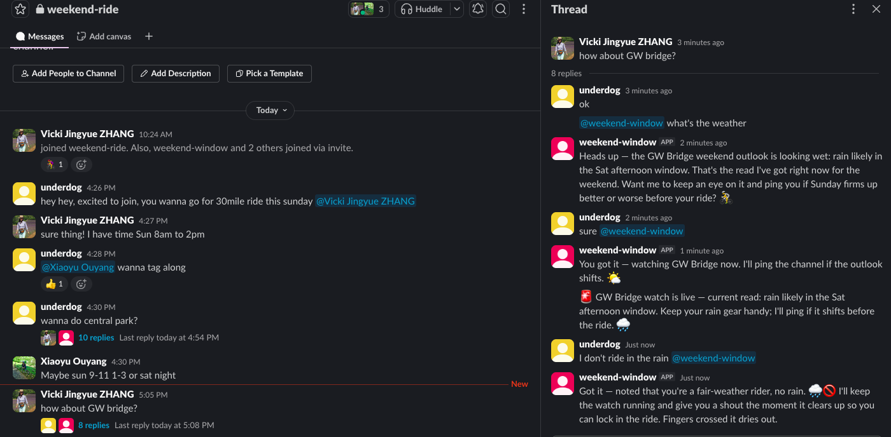

# Claude Tag, rebuilt on Claude Managed Agents

[](https://github.com/hippogriff-ai/claude-tag-w-cma/actions/workflows/tests.yml)
[](docs/RUNS.md)
[](https://platform.claude.com/docs/en/managed-agents/overview)
[](weekend-window/app/requirements.txt)

A minimal, runnable teaching demo of how the **Claude Tag** experience — a shared AI teammate living in a Slack
channel — is reconstructed from **Claude Managed Agents (CMA)** primitives. The scenario: friends planning a
weekend bike ride ask **@weekend-window** to watch the weather; it pings the channel **on its own** when the
forecast changes.



*Left: availability chatter in the main channel. Right: inside the 🧵 "how about GW bridge?" thread — a real
forecast on ask, a watch on request, an unprompted first-outlook ping, and a durable preference the agent wrote
to its memory store.*

Three pillars, each carried by a named CMA primitive:

| Claude Tag behavior | CMA primitive here |
|---|---|
| **Multiplayer** — one shared agent everyone talks to | one durable **session per channel** (`sessions.create`, reused across turns *and* restarts) |
| **Memory** — conversation context + durable group knowledge | the session (conversation) + a **memory store per channel** the model reads/writes itself — the group's knowledge survives restarts and never leaks across channels |
| **Async + proactive** — watch requested in plain language, pings unprompted on change | **custom tools** (`get_forecast` · `schedule_monitor` · `cancel_monitor` · `list_monitors`) answered by a broker via the `agent.custom_tool_use → requires_action → user.custom_tool_result` round-trip; changes are fed back into the session so the **model phrases the ping**; watches are persisted and **survive broker restarts** |

The agent is created **once** (`agents.create`, versioned; no network access — weather and geocoding run
broker-side). On every @mention the broker pulls the conversation the agent hasn't seen (main channel + thread)
into the session — details in
[`weekend-window/app/README.md` → Context management](weekend-window/app/README.md#context-management--how-main-chat-and-thread-context-are-taken-in).

## Layout

```
weekend-window/
  SPEC.md              the essence spec + passing criteria + verified platform facts
  app/                 the implementation (see its README for architecture + setup)
.claude/skills/setup/  a /setup coach that walks the Slack app + token setup
```

## Quickstart

```bash
cd weekend-window/app
python run_demo.py                  # no credentials: watch → change → proactive post, in seconds

# the real thing — needs a Slack app + tokens: type /setup in Claude Code for a
# guided walkthrough (the repo ships the skill), or follow app/README.md
cp .env.example .env.local          # fill SLACK_BOT_TOKEN, SLACK_APP_TOKEN, ANTHROPIC_API_KEY
python3 -m venv .venv && .venv/bin/pip install -r requirements.txt
.venv/bin/python provision.py       # once, idempotent: CMA environment + agent + memory store
.venv/bin/python slack_app.py       # START THE BOT — long-lived; run it in its own terminal
```

## What this demo is (and isn't)

It exists to show the **essence of Claude Tag on CMA primitives** with the simplest possible domain (free,
keyless weather data). Deliberately cut: per-location subagent fan-out, session-per-thread, crash-safety proofs,
and any bespoke UI. [`weekend-window/SPEC.md`](weekend-window/SPEC.md) is the source of truth for scope, the
passing criteria, and the verification results the badges point to.
